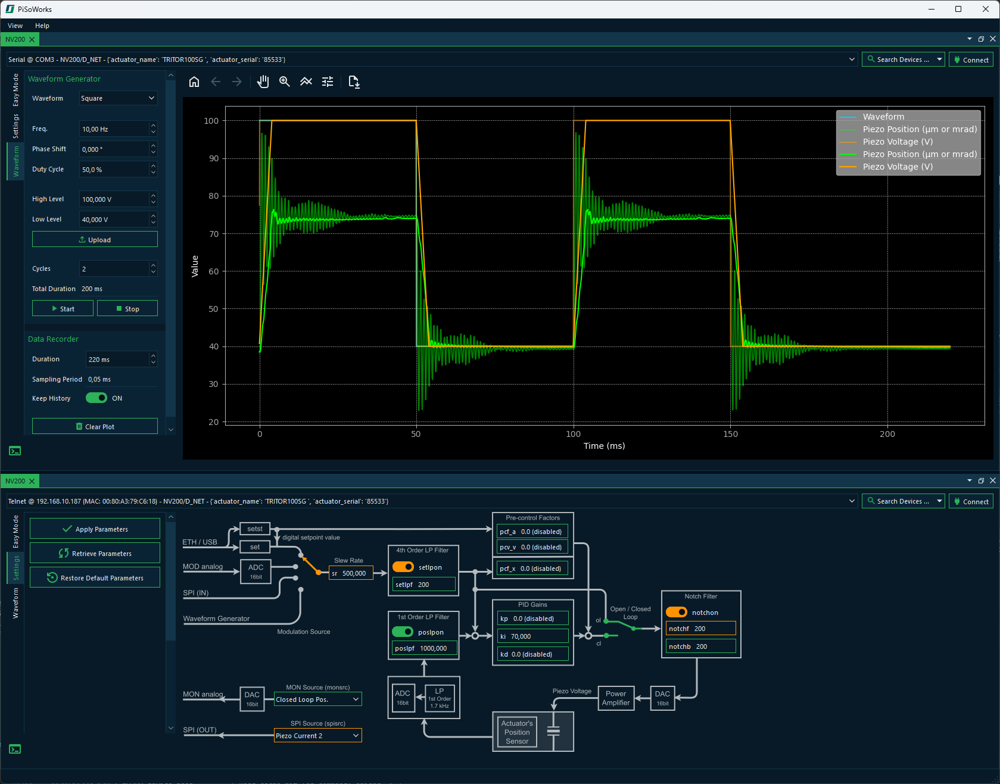
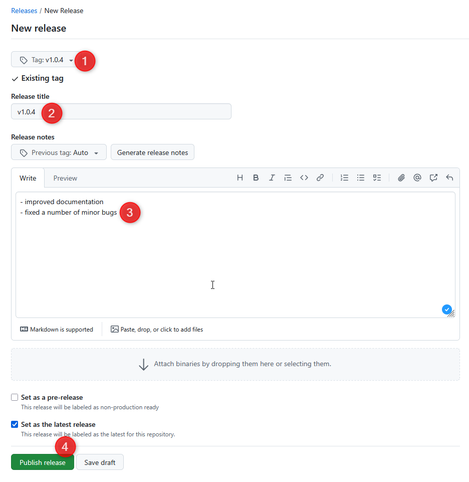

# PySoWorks

[](https://pypi.org/project/pysoworks/)
[](https://pypi.org/project/pysoworks/)
[](https://piezosystemjena.github.io/PySoWorks/)
[](https://github.com/piezosystemjena/PySoWorks/releases/latest/)
[](https://github.com/piezosystemjena/PySoWorks/actions/workflows/publish-pypi.yml)
[](https://github.com/piezosystemjena/PySoWorks/actions/workflows/build-windows.yml)

PySoWorks is an application for controlling the piezo amplifiers, such as the [NV200/D](https://www.piezosystem.com/product/nv-200-d-compact-amplifier/), from [piezosystem jena](https://www.piezosystem.com/) GmbH. It demonstrates the use of the [NV200 Python library](https://pypi.org/project/nv200/) within a graphical interface based on PySide6.



## For Users

## Features 

- GUI based on PySide6
- Support for NV200 hardware control
- Supports control of multiple devices
- Dark mode theming

### Quick Install

Install from **PyPI**:

```shell
pip install pysoworks
```

### Install in a Virtual Environment (Recommended)

Using venv (built-in Python module):

```shell
# Create a virtual environment
python -m venv .venv

# Activate the virtual environment
# On Windows:
.venv\Scripts\activate
# On macOS/Linux:
source .venv/bin/activate

# Upgrade pip
pip install --upgrade pip

# Install pysoworks from PyPI
pip install pysoworks
```

### Usage

Once installed, you can launch the application from the terminal:

```shell
pysoworks
```

## For Developers

This project uses [Poetry](https://python-poetry.org/) for Python dependency management, packaging, and publishing. Poetry provides a modern, streamlined alternative to `pip` and `virtualenv`, handling everything from installing dependencies to building and publishing the package.

If you're contributing to the project or running it locally for development, the steps below will help you set up your environment.

### Installing poetry

If necessary, install [poetry] according to the official [installation instructions](https://python-poetry.org/docs/#installation) 
(it's recommended to use [pipx](https://github.com/pypa/pipx) to install poetry in its own isolated environment but still have it available as a system wide command). If you already have installed and configured poetry,
you can skip this step.

```shell
pip install pipx
pipx ensurepath
```

Now reload your shell or create a new instance and execute the following steps:

```shell
pipx install poetry
poetry self add "poetry-dynamic-versioning[plugin]"
poetry config virtualenvs.in-project true
```

#### Some background information about poetry config

By default, Poetry creates virtual environments in `{cache-dir}/virtualenvs`
(Windows: `%USERPROFILE%/AppData/Local/pypoetry/Cache/virtualenvs`).

You can instead configure Poetry to create the virtual environment inside the project directory by setting:

```shell
poetry config virtualenvs.in-project true
```

This will place the virtualenv in a `.venv` folder at the project root the next time you run `poetry install`.

Now, when we run `poetry install` in a project directory, it will create and install all dependencies 
(and the project itself) into an in-project virtualenv located in `{project-root}/.venv`.

> **Note:**  
> If you already have an existing environment in the default location (i.e. out-of-project) and would like to convert to an in-project virtualenv, you have to first remove the existing virtualenv, ensure that the `virtualenvs.in-project` option is set to `true` and then create the new in-project virtualenv using `poetry install` (see [below](#installing-dependencies)) again.
> 
> To remove the existing virtualenv, first get its name and then remove it:
> 
> ```shell
> poetry env list   # note the name of the environment
> poetry env remove <name>
> ```
> 
> If you're sure you only have one environment, you can also just use `poetry env remove --all`.


### Installing dependencies

#### Required dependencies

To install all required dependencies and set up the project in editable mode use:

```shell
poetry install
```

To skip installing the project itself (i.e. install only dependencies):

```shell
poetry install --no-root
```

#### Optional dependencies

Some extra features are provided via optional dependencies.

- Install all **optional packages**:

```shell
poetry install --all-extras
```

- Install **specific extras**:

```shell
poetry install --extras "extra1 extra2"
# or
poetry install -E extra1 -E extra2
```

### Updating dependencies

PySoWorks uses the `nv200` library for NV200 device control. Whenever you update the release of the
NV200 library, you should also update the version used for PySoWorks:

```shell
poetry update nv200
```

## Building the documentation

### Extract Git Version information

Documentation is generated using [Sphinx](https://www.sphinx-doc.org/), located in the `doc/` folder.
Before you create the documentation, you should generate the dynamic version information file `VERSION`
by running the following command:

```shell
python generate_version.py
```

This will extract the version information from Git and stores it into `VERSION` file for later use
by documentation, exe or installer builds. Normally the file will contains something like this for
a development version:

```
1.0.5.dev4
```

and this vor a tagged release version:

```
1.0.4
```

### Building with Poetry

HTML Documentation - the results are in `doc/_build/` folder.

```shell
poetry run sphinx-build -b html doc/ doc/_build/
```

PDF Documentation - the results are in `build/pdf` folder.

```shell
poetry run sphinx-build -b pdf doc build/pdf
```

## Building and Publishing

### Building the Wheel

To build a distributable `.whl` package:

```shell
poetry build
```

This creates a `.whl` and `.tar.gz` file in the `dist/` directory.

### Publishing the Wheel

#### To TestPyPI

Before you publish your package to PyPi you should test it with TestPyPi:

```shell
poetry build
poetry config repositories.test-pypi https://test.pypi.org/legacy/
poetry config pypi-token.test-pypi your-token-here
poetry publish -r test-pypi
```

If you would like to test the installation from TestPyPi, you should use the
following command:

```shell
pip install -i https://test.pypi.org/simple/ --extra-index-url https://pypi.org/simple pysoworks
```

 This avoids dependency resolution issues by:

- Getting your test package (pysoworks) from **Test PyPI**
- Getting all other packages (e.g., matplotlib, pyside6, etc.) from **PyPI**

#### To PyPI

If publishing to TestPyPi works, you can publish to PyPi:

```shell
poetry build
poetry config repositories.pypi https://upload.pypi.org/legacy/
poetry config pypi-token.pypi your-token-here
poetry publish -r test-pypi
```

### Building a Standalone Executable (.exe) with PyInstaller

Before you build the executable or the installer you need to update the `VERSION` file that
contains the version information that is extracted from Git and used by the application
and by the installer. To update the `VERSION` file you need to run the `generate_version`

```shell
python generate_version.py
```

You can create a standalone executable of PySoWorks using **PyInstaller**.

Make sure **PyInstaller** is installed in your environment, normally this
is done by `poetry install` as a dev dependency. Build the executable using the provided 
spec file using this command:

```shell
poetry run pyinstaller --clean --log-level=DEBUG pysoworks.spec
```

- `--clean` clears any temporary PyInstaller files before building.

- `--log-level=DEBUG` enables detailed logging to help diagnose any build issues.

The resulting executable will be located in the `dist/` directory.

### Building the installer

The project uses [Inno Setup](https://jrsoftware.org/isinfo.php) for building the Windows installer. Ensure that
you have installed Inno Setup and that is is in the path variable. To build the installer execute the
following command:

```shell
iscc .\pysoworks_inno_setup.iss
```

## Creating a release

Do the following steps, to create a release:

1. Update dependencies - i.e. if you modified `NV200` library, then update it via `poetry update nv200`
2. Update the `CHANGELOG.md` file with the new release number i.e. 1.0.4
3. Commit the changes and push them to GitHub
4. Check if the `PySoWorks.exe` and the installer `PySoWorks_Setup.exe` are built properly
5. Test `PySoWorks.exe` and the installer `PySoWorks_Setup.exe` if both run without problems
6. Check if puplishing to TestPyPi works - that means that action is successful
7. Create a new git tag i.e. `v1.0.5` and push the repository to GitHub with the option `Include Tags` to push the new tag to GitHub
8.  GitHub should now create and publish the new version to PyPi - check if it works properly
9.  Got to `Releases` section in GitHub and select `Draft a new release`
10. Create a new Release in GitHub named the same as the Tag (2) and use the created tag (1)
11. Copy the information in the `CHANGELOG.md` in the editor (3) and click `Publish release` button (4)



12. Now GitHub workflow should create a new EXE and Installer suffixed with the new tag
