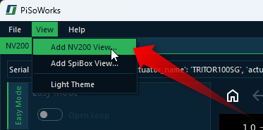
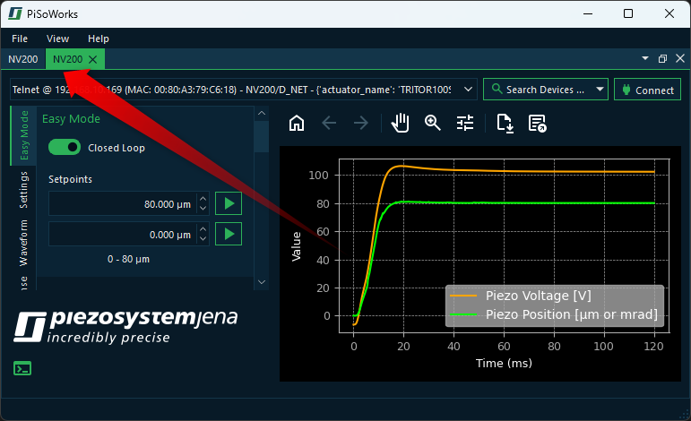

Working With Multiple Devices
================================

Introduction to Multi Device control
--------------------------------------

Immediately after starting the application, you will see a window for controlling a single NV200 device. 
However, the software also allows you to control additional devices.

To connect to additional devices, click the :menuselection:`View --> Add NV200 View...` menu item in the main menu.

This will add a new **NV200** view as a new tab in the main window. You can switch between different **NV200** views 
using the tab bar at the top of the window. Each tab represents a separate instance of the **NV200** view, allowing 
you to control a different device with each single view.

Introduction to Views
----------------------

The single NV200 control interfaces are organized as **Views**. The **Views** are windows that contain the display 
and control elements for a specific task or device.

The software provides a very flexible layout and docking system that allows you to arrange the views in the main window
to your liking. All views can be freely moved within the main window via drag & drop. All views can be shown and hidden 
and the views can also be removed from the main window via drag & drop to move them to another screen. 
This allows you to adapt the user interface of the software optimally to your requirements and to arrange the device
windows in a way that suits you best.

Moving Views
----------------------

There are several ways to move views. The first option is Drag & Drop. To do this, click with the left mouse button 
on the tab of the view :guinum:`❶` and simply drag the view from its position :guinum:`❷` with the mouse button held down. 
A transparent copy of the view is displayed and follows the mouse pointer as long as you keep the mouse button pressed. 
This indicates that a drag & drop operation for moving a view is active. As long as you do not release the mouse button, 
you can move the view freely (see figure below).