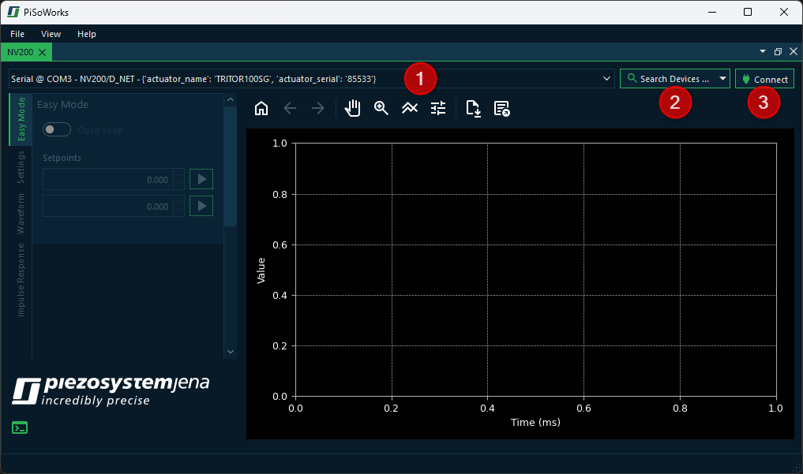
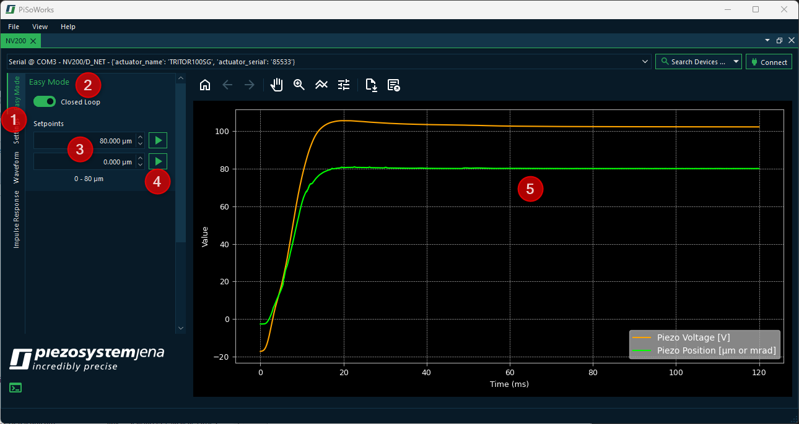
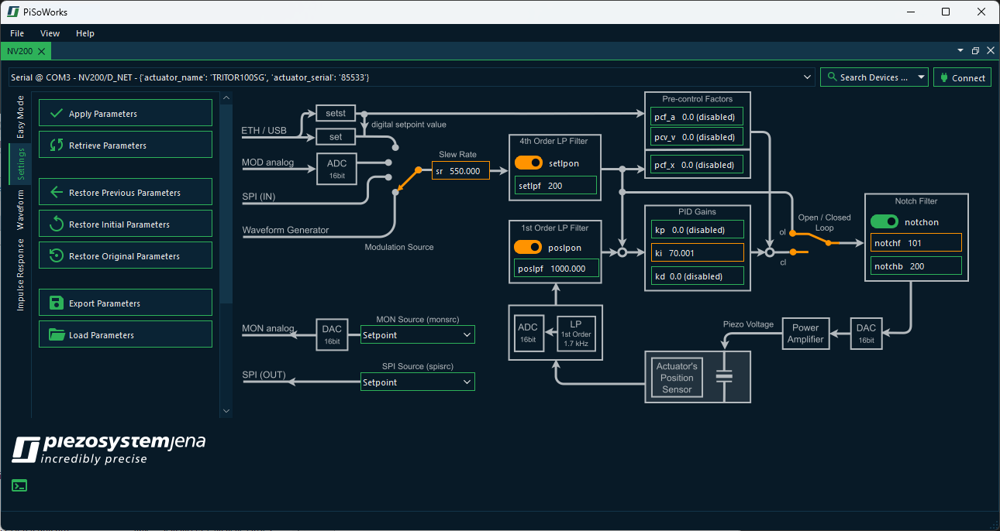
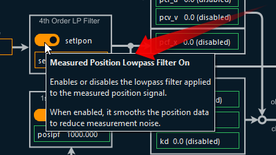
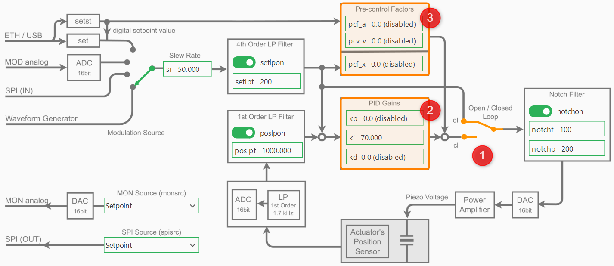
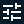

Getting Started
=====================

Before starting the software, your NV200 should be connected to the PC and powered on.
Follow these steps:

- Connect your piezo actuator to the NV200
- Connect the NV200 to your PC via USB
- Connect the power supply to the NV200 to switch the device on

Now you can start the PySoWorks application. Right after the start, you should see the following:

The device list :guinum:`❶` shows all detected NV200 device connected via USB. 
If you have multiple devices connected, you can select the one you want to control. If your device is
connected via Ethernet, you need to click the :guilabel:`Search Devices` button :guinum:`❷`. 
Once you have selected your device in the device list, click the :guilabel:`Connect` button :guinum:`❸`.

.. rst-class:: guinums

Easy Mode
=====================

Setpoint Control
-----------------------

Immediately after connecting, you will be in the :guilabel:`Easy Mode` panel. Here, you can manually move your
piezo actuator by specifying a target voltage (open loop) or a target position (closed loop). 
This means you first need to decide whether you want to operate in closed loop or in open loop mode using
the toggle switch :guinum:`❷`.

Afterwards, you can enter the target position or target voltage in the setpoint input fields :guinum:`❸`. 
The movement to a setpoint is initiated by clicking the corresponding start button :guinum:`❹`. With the two 
available input fields, the actuator can be conveniently moved between two positions or voltage values.

The plot :guinum:`❺` displays the measured voltage and position of the piezo actuator for the most recent movement. 
The x-axis typically represents time in ms, while the y-axis shows the corresponding actuator 
position or applied voltage.

Plot Interaction and Data Export
----------------------------------

Users can interact with the plot using the toolbar to zoom in on specific regions, pan across the data, or reset the view to its original state. 
In addition, the data displayed in the plot can be exported in Excel or CSV format for further analysis or documentation. 
This provides a convenient way to visualize and process the actuator's behavior during operation.

The following tools are available for plot interaction:

+------------------------+-------------------------------+---------------------------------------------------------------------------------------------------------------------------------------+
| Button                 | Function / Action             | Detailed Description / User Instructions                                                                                              |
+========================+===============================+=======================================================================================================================================+
| |home|                 | Resets the plot view.         | Returns the plot to its original view. Use this to undo any zoom or pan operations.                                                   |
+------------------------+-------------------------------+---------------------------------------------------------------------------------------------------------------------------------------+
| |back|                 | Step back in navigation       | Moves back to the previous view in the navigation history. Useful if you want to revert a recent zoom or pan.                         |
|                        | history.                      |                                                                                                                                       |
+------------------------+-------------------------------+---------------------------------------------------------------------------------------------------------------------------------------+
| |forward|              | Step forward in navigation    | Moves forward to the next view in the navigation history. Works only after using “Back”.                                              |
|                        | history.                      |                                                                                                                                       |
+------------------------+-------------------------------+---------------------------------------------------------------------------------------------------------------------------------------+
| |pan|                  | Activate pan mode.            | Click the button to enable panning. Then click and drag on the plot to move it horizontally or vertically. Click the button again     |
|                        |                               | to deactivate pan mode.                                                                                                               |
+------------------------+-------------------------------+---------------------------------------------------------------------------------------------------------------------------------------+
| |zoom|                 | Activate zoom mode.           | Click the button to enable zooming. Then click and drag a rectangular area to zoom in.                                                |
|                        |                               | Click the button again to deactivate zoom mode.                                                                                       |
+------------------------+-------------------------------+---------------------------------------------------------------------------------------------------------------------------------------+
| |curve|                | Adjust layout.                | Opens a dialog where you can change plot line colors, margins, and axis settings. This allows fine-tuning of plot appearance before   |
|                        |                               | saving or printing.                                                                                                                   |
+------------------------+-------------------------------+---------------------------------------------------------------------------------------------------------------------------------------+
| |image_save|           | Save plot as an image file.   | Opens a file dialog to save the plot in various formats (PNG, PDF, SVG, etc.). Choose the location and file type, then confirm to     |
|                        |                               | export.                                                                                                                               |
+------------------------+-------------------------------+---------------------------------------------------------------------------------------------------------------------------------------+
| |export|               | Export data to Excel or CSV   | Opens a file dialog to export the plot`s underlying data. Choose the location, filename, and format (Excel .xlsx or CSV). Click       |
|                        |                               | “Save” to export the data for further analysis or reporting.                                                                          |
+------------------------+-------------------------------+---------------------------------------------------------------------------------------------------------------------------------------+

Settings
=====================

Settings Overview
----------------------------------

By clicking the Settings tab, you enter the settings section of the application. This section displays the 
functional block diagram of the device along with all relevant parameters that can be adjusted by the user.

Changing the parameters is carried out in two steps:

#. Modify all parameters whose values need to be adjusted.
#. Click :guilabel:`Apply Parameters` to transfer the updated parameters to the device.

All parameters that have been modified but not yet transferred to the device are highlighted in orange. 
Move the mouse pointer over the individual fields in the block diagram to display a tooltip and obtain
detailed information about the corresponding parameters.

To the left of the block diagram, you will find all actions available for this section:

Apply Parameters
   Send the currently edited parameters to the device to update its configuration.

Retrieve Parameters
   Read the current parameters from the device and update the local view in case you modified 
   the parameters from outside or via a terminal program.

Restore Previous Parameters
   Reverts parameters to their values before the last time you clicked :guilabel:`Apply Parameters`.
   This is some kind of undo function for the last change.

Restore Initial Parameters
   Load the parameters as they were when the device was first connected this session.

Restore Original Parameters
   Restore the parameters that were backed up when this device was first connected.

Export Parameters
   Exports the current parameters into a parameters :file:`*.ini` file.

Load Parameters
   Loads the parameters from a previously exported :file:`*.ini` file.

Parameter Backup
----------------------------------

Actuators connected to the NV200 amplifier store important default control parameters in their EEPROM. These include:

- Low-pass and notch filter settings
- PID gains (kp, ki, kd)
- Closed-loop control settings

Changing these values will overwrite them in the actuator's nonvolatile memory. If the new parameters are incorrect 
or unstable, it may degrade device performance or behavior.

.. warning::

   Always **export and save** the actuator configuration using :guilabel:`Export Parameters` button **before** 
   writing or experimenting with actuator parameters.

PID Controller Parameters
----------------------------------

The following image shows the block diagram of the device with the PID parts highlighted:

PID Control Mode
^^^^^^^^^^^^^^^^^^^^^^

The PID-controller can work in two different modes: The open loop mode (OL) and the closed loop mode (CL).
To change the the mode, you can use :guilabel:`Open / Closed Loop` toggle switch :guinum:`❶` in the block diagram.

In open loop mode the PID-controller is bridged and the command input directly controls the amplifier, 
which can provide a voltage between -20 V and +180 V, however, limited to the admissible voltage range 
of the connected piezo actuator. The resulting piezo stroke then depends on the characteristic of the 
piezo actuator and is affected by piezo-typical creeping and hysteresis behavior.

In closed loop mode (CL), these effects will be compensated by the digital loop controller. The
position sensor value can also be filtered with an adjustable 1st order low pass filter in order to 
reduce the measurement noise spectrum. 

PID Gains
^^^^^^^^^^^^^^^^^^^^^^

The controller-specific parameters are stored in the actuator's ID-chip. The default parameters were 
determined in the piezosystem jena laboratory and ensure safe function of the actuator and will work 
for most applications. Depending on your application, additional load, setpoint trajectory and motion 
requirements, fine tuning of the control parameters will most likely improve your results.

.. warning::

   Always **export and save** the actuator configuration **before** writing or experimenting with actuator 
   parameters (see `Parameter Backup`).

To adapt the controller properties to your special application please start with the default values and
then adjust the PID Gains **kp**, **ki** and **kd** :guinum:`❷`.

.. admonition:: Important
   :class: note

   To adapt the controller properties to your special application please start with the default values. In general, 
   change the parameters in small steps and, depending on the actuator's reaction, slightly increase the step size.
   If the system begins to oscillate, switch to open loop mode immediately, then reset to stable values again.

   