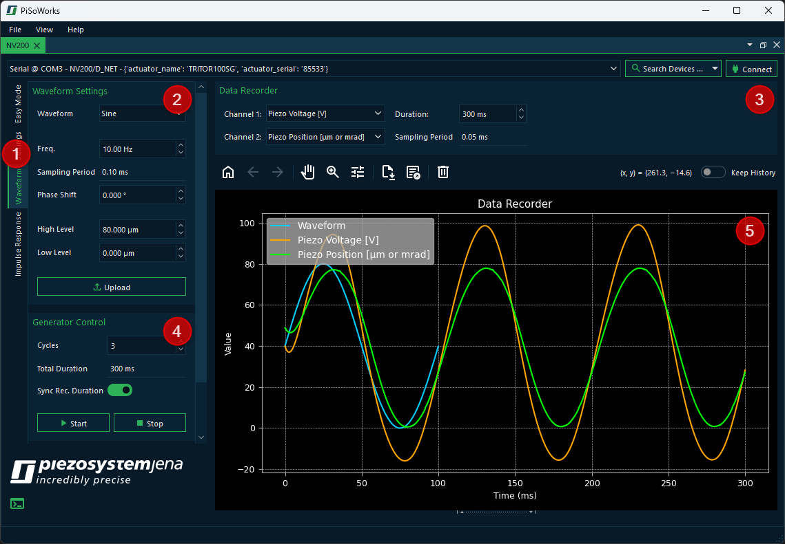

Waveform Generator
===================

The NV200 device has an arbitrary waveform generator. This waveform generator that can be used
to generate a variety of waveforms. The arbitrary waveform generator can generate a single or 
repetitive setpoint signal. The curve shape can be freely defined by up to 1024 samples.

